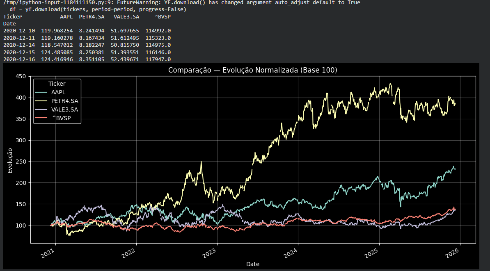

# 📈 Comparação de Ativos Financeiros — Normalização Base 100

Este projeto apresenta um script em Python para baixar, normalizar e comparar dados históricos de múltiplos ativos financeiros.  
A normalização em **Base 100** permite comparar o desempenho percentual relativo de ativos com preços muito diferentes — por exemplo, comparar **AAPL x Ibovespa x VALE3** no mesmo gráfico.

---

## ⚙️ Tecnologias Utilizadas
- **Python 3**
- **yfinance** — Coleta de dados do Yahoo Finance  
- **pandas** — Manipulação e limpeza de dados  
- **matplotlib** — Visualização gráfica  

---

## 🚀 Como Executar o Projeto

### 1. Instalar dependências

```bash
pip install yfinance pandas matplotlib 
```

### 2. O Script 
```bash
import yfinance as yf
import pandas as pd
import matplotlib.pyplot as plt

plt.rcParams["figure.figsize"] = (14, 6)

def baixar_dados(tickers, period="5y"):

    df = yf.download(tickers, period=period, progress=False)

    
    df = df["Close"]

    
    if isinstance(df, pd.Series):
        df = df.to_frame()

    return df.dropna(how="all")

def normalizar(df):

    return df.div(df.iloc[0]).mul(100)


tickers = ["^BVSP", "AAPL", "VALE3.SA", "PETR4.SA"]


dados = baixar_dados(tickers, period="5y")
print(dados.head())


dados_norm = normalizar(dados)


dados_norm.plot(title="Comparação — Evolução Normalizada (Base 100)")
plt.ylabel("Evolução")
plt.grid(alpha=0.3)
plt.show()

```
# 📈 Comparação de Ativos Financeiros (Base 100)

Aqui está um exemplo da visualização de comparação de desempenho gerada pelo script:




